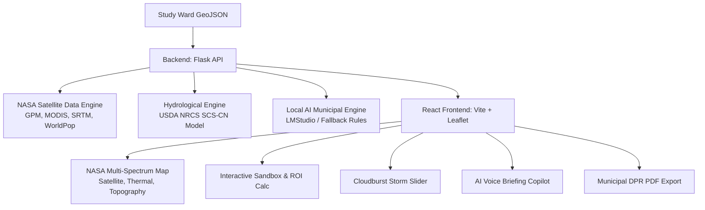

# 🗺️ TerraSense: End-to-End Task Breakdown (From Scratch to WEHACK 2026)

This document provides a **complete, chronological, task-by-task engineering roadmap** to build **TerraSense (AI Climate Digital Twin)** from Day 1 to the final hackathon stage presentation.

---

## 🏗️ Project Architecture Overview



---

## 📋 Chronological Task Breakdown

---

### 🔹 Phase 0: Workspace Setup & Environment Configuration

- [ ] **Task 0.1: Initialize Project Directory Structure**
  - **Goal:** Set up a clean monorepo separating `backend/`, `frontend/`, `data/`, and documentation.
  - **Folder Hierarchy:**
    ```
    ├── backend/
    │   ├── app.py                 # Flask server & simulation logic
    │   ├── requirements.txt       # Python dependencies
    │   └── trichy_area.geojson    # Default study ward
    ├── frontend/
    │   ├── public/                # Vector logos & static assets
    │   ├── src/
    │   │   ├── components/        # Map, cards, floating panel, sandbox
    │   │   ├── utils/             # Voice briefing, PDF generator
    │   │   ├── App.jsx            # Main state & reactive overlay
    │   │   └── main.jsx
    │   ├── package.json           # React dependencies
    │   └── vite.config.js
    ├── test_system.py             # Automated end-to-end verification
    └── start.bat                  # One-click dual server launcher
    ```

- [ ] **Task 0.2: Backend Dependencies (`requirements.txt`)**
  - **Dependencies needed:**
    - `flask`, `flask-cors` (REST API)
    - `requests` (HTTP requests to GEE & AI services)
    - `numpy` (hydrological computations)
    - `earthengine-api` (optional Google Earth Engine client)

- [ ] **Task 0.3: Frontend Dependencies (`package.json`)**
  - **Dependencies needed:**
    - `react`, `react-dom`
    - `leaflet`, `react-leaflet` (Map visualization)
    - `lucide-react` (icons)
    - `@vitejs/plugin-react`, `vite`

- [ ] **Task 0.4: Branding & Vector Identity**
  - **Goal:** Create high-res orbital planetary vector logo (`frontend/public/nasa-logo.svg`) with `WEHACK 2026 • CLIMATE DIGITAL TWIN` branding.

---

### 🔹 Phase 1: Geospatial Geometry & NASA Satellite Pipeline

- [ ] **Task 1.1: Study Ward Boundary Parser & Geodesic Geometry**
  - **File:** `backend/app.py`
  - **Implementation:**
    - Parse GeoJSON polygons.
    - Compute bounding box: `min_lon, min_lat, max_lon, max_lat`.
    - Compute centroid: `center_lon, center_lat`.
    - Compute geodesic area using the **Shoelace Formula** adjusted for latitude:
      $$\text{Area (Hectares)} = \left| \sum_{i=1}^{n} (\text{lon}_i \cdot \text{lat}_{i+1} - \text{lon}_{i+1} \cdot \text{lat}_i) \right| \times \frac{111.32 \times 111.32 \times \cos(\text{lat}_{\text{avg}})}{2} \times 100$$

- [ ] **Task 1.2: NASA Satellite Data Integration**
  - **Datasets Targeted:**
    1. **NASA GPM IMERG:** Design storm precipitation (mm).
    2. **NASA MODIS Terra/Aqua (MOD11A2):** Land Surface Temperature (LST, °C).
    3. **NASA SRTM 30m DEM:** Mean elevation and terrain slope.
    4. **WorldPop / LandScan:** Population density and exposed residents.
    5. **NASA SMAP:** Antecedent soil moisture condition (AMC II).

- [ ] **Task 1.3: Zero-Downtime Calibrated Baseline Fallback**
  - **Implementation:** If Google Earth Engine authentication is absent at the hackathon, gracefully provide calibrated real-world satellite values (e.g., Trichy pilot ward: $180\text{ mm}$ rain, $34.2^\circ\text{C}$ LST, $85\text{m}$ elevation, $65\%$ imperviousness) so the system never fails or crashes.

---

### 🔹 Phase 2: Hydrological Modeling & Risk Inundation

- [ ] **Task 2.1: USDA NRCS SCS Curve Number Runoff Engine**
  - **File:** `backend/app.py` & `frontend/src/App.jsx`
  - **Formulas:**
    - Urban composite Curve Number: $CN = 78$
    - Potential Maximum Soil Retention ($S$):
      $$S = \frac{25400}{CN} - 254 = 71.74\text{ mm}$$
    - Initial Abstraction ($I_a$):
      $$I_a = 0.2 \times S = 14.35\text{ mm}$$
    - Direct Stormwater Runoff Depth ($Q$ in mm):
      $$Q = \begin{cases} \frac{(P - I_a)^2}{P - I_a + S} & \text{if } P > I_a \\ 0 & \text{if } P \le I_a \end{cases}$$
    - Peak Runoff Surge $\%$:
      $$\Delta Q\% = \frac{Q_{\text{scenario}} - Q_{\text{baseline}}}{Q_{\text{baseline}}} \times 100$$

- [ ] **Task 2.2: IPCC Climate Scenario Projections**
  - **Baseline:** Current observed satellite precipitation & temperature.
  - **RCP 4.5 (+2°C):** $+10\%$ Precipitation surge, $+2.0^\circ\text{C}$ surface warming.
  - **RCP 8.5 (Extreme):** $+20\%$ Precipitation surge, $+4.1^\circ\text{C}$ surface warming.

- [ ] **Task 2.3: Bounding-Box Proportional Flood Polygon Generator**
  - **Implementation:** Generate a GeoJSON Polygon centered on the ward centroid. Scale the buffer width dynamically:
    - *Baseline:* $35\%$ of ward span (Amber `#FF6B35`)
    - *RCP 4.5:* $65\%$ of ward span (Red `#E43700`)
    - *RCP 8.5:* $88\%$ of ward span (Crimson `#900C3F`)

- [ ] **Task 2.4: Thermal Heat Stress Classification**
  - **WHO Thresholds:**
    - $< 32^\circ\text{C}$: Low Heat Stress
    - $32^\circ\text{C} - 37^\circ\text{C}$: Moderate Heat Stress
    - $> 37^\circ\text{C}$: High / Extreme Heat Stress

---

### 🔹 Phase 3: Flask Backend API

- [ ] **Task 3.1: Health & Diagnostics (`GET /api/health`)**
  - Returns backend status, uptime, and Earth Engine authentication state.

- [ ] **Task 3.2: Climate Simulation Endpoint (`POST /api/simulate`)**
  - **Request Body:** `{ "scenario": "rcp45", "plan": <GeoJSON>, "uploadedFileName": "trichy_area.geojson" }`
  - **Response:** Calculated `metrics`, `interventions`, and `overlays` GeoJSON.

- [ ] **Task 3.3: AI Recommendations Endpoint (`POST /api/recommendations` & `POST /api/chat`)**
  - Connects to local LMStudio (`http://localhost:1234/v1/chat/completions`) with a strict prompt returning municipal interventions in INR Lakhs.
  - Falls back gracefully to calibrated urban civil interventions if LMStudio is offline.

---

### 🔹 Phase 4: React + Leaflet Frontend & Map View

- [ ] **Task 4.1: React Leaflet Setup & Base Styling**
  - **File:** `frontend/src/components/MapView.jsx`
  - Render OpenStreetMap & NASA GIBS TrueColor Satellite tiles (`epsg3857 MODIS_Terra_CorrectedReflectance`).

- [ ] **Task 4.2: NASA Multi-Spectrum Layer Switcher**
  - **4 Selectable Layers:**
    1. 🛰️ **NASA GIBS True-Color**
    2. 🌡️ **MODIS Thermal LST Overlay**
    3. 🏔️ **SRTM Topography & Elevation Terrain**
    4. 🗺️ **Streets & Built-up Basemap**

- [ ] **Task 4.3: Reactive GeoJSON Layers & Tooltip Popups**
  - Bind Blue dashed boundary to the Study Area.
  - Bind Red/Amber overlay to the Climate Risk Zone with custom click popups showing risk tag, water depth, and runoff metrics.
  - Ensure dynamic `key` props to force clean Leaflet remounting on click.

- [ ] **Task 4.4: System Status Bar & Interactive Map Legend**
  - Display Backend Online, Earth Engine state, WEHACK 2026 badge, and active ward name.

---

### 🔹 Phase 5: Policy Sandbox & Cloudburst Simulator

- [ ] **Task 5.1: Green Infrastructure Sandbox**
  - **File:** `frontend/src/components/InterventionsSection.jsx`
  - Interactive checkboxes on each intervention card (*Smart Retention Basin*, *Permeable Bioswales*, *Sponge Park*).
  - Toggling solutions triggers dynamic flood zone shrinkage on the map.

- [ ] **Task 5.2: Live Municipal ROI Calculator**
  - Calculate in real time:
    - **Total Capital Investment (₹ Cr)**
    - **Total Runoff Mitigation (-%)**
    - **Projected Property Damage Prevented (₹ Cr)**
    - **Net Municipal ROI (+%)**
    - **Citizens Protected Count**

- [ ] **Task 5.3: Live Cloudburst & Storm Severity Slider**
  - **File:** `frontend/src/components/FloatingPanel.jsx` & `frontend/src/App.jsx`
  - Slider ranging from **50mm (Light Rain)** $\rightarrow$ **180mm (Design Storm)** $\rightarrow$ **350mm (Cloudburst Event)**.
  - Recalculates SCS-CN runoff volume, peak discharge, and resizes the map flood polygon live as the slider is dragged.

---

### 🔹 Phase 6: Executive Presentation & Export Suite

- [ ] **Task 6.1: TerraSense AI Voice Briefing Copilot**
  - **File:** `frontend/src/utils/voiceBriefing.js`
  - Native Web Speech API wrapper to narrate a 20-second executive audio briefing on stage.

- [ ] **Task 6.2: One-Click Municipal DPR PDF Exporter**
  - **File:** `frontend/src/utils/dprReportGenerator.js`
  - Generates a print-ready **Detailed Project Report (DPR)** with ward coordinates, flood affected hectares, water depth, surplus runoff volume (Million Liters), and department sign-off boxes.

- [ ] **Task 6.3: Automated Testing & Startup Launcher**
  - **File:** `test_system.py` (Validates health, simulation, and fallback APIs).
  - **File:** `start.bat` (Starts backend and frontend concurrently).

---

### 🔹 Phase 7: Live WEHACK 2026 Presentation & Pitch Plan

- [ ] **Task 7.1: 3-Minute Live Judge Pitch Flow**
  1. **Hook (0:00–0:30):** Climate change turns normal monsoons into catastrophic urban flash floods. Municipalities lack real-time predictive spatial tools.
  2. **Solution (0:30–1:15):** Introduce **TerraSense** — combining NASA Earth observation satellites (GPM, MODIS, SRTM) with USDA hydrological modeling.
  3. **Live Demo (1:15–2:15):**
     - Click `"Run NASA Analysis"`.
     - Drag the **Cloudburst Slider** to 300mm $\rightarrow$ show flood zone expanding on the map.
     - Switch to **MODIS Thermal Heatmap** $\rightarrow$ show Urban Heat Island.
     - Open **Policy Sandbox** $\rightarrow$ toggle Smart Retention Basin and show live ROI (+440%) & flood zone shrinking.
     - Click **`"🎙️ AI Voice Briefing"`** to play the audio summary.
     - Click **`"📄 Export DPR (PDF)"`** to show the municipal report ready for city planners.
  4. **Impact & Close (2:15–3:00):** Ready for immediate deployment across municipal smart cities.

---

## 🚀 Quick Commands Cheatsheet

```bash
# 1. Install Dependencies
pip install -r backend/requirements.txt
cd frontend && npm install && cd ..

# 2. Run Automated System Test
python test_system.py

# 3. Start Backend
cd backend && python app.py

# 4. Start Frontend
cd frontend && npm run dev
```
